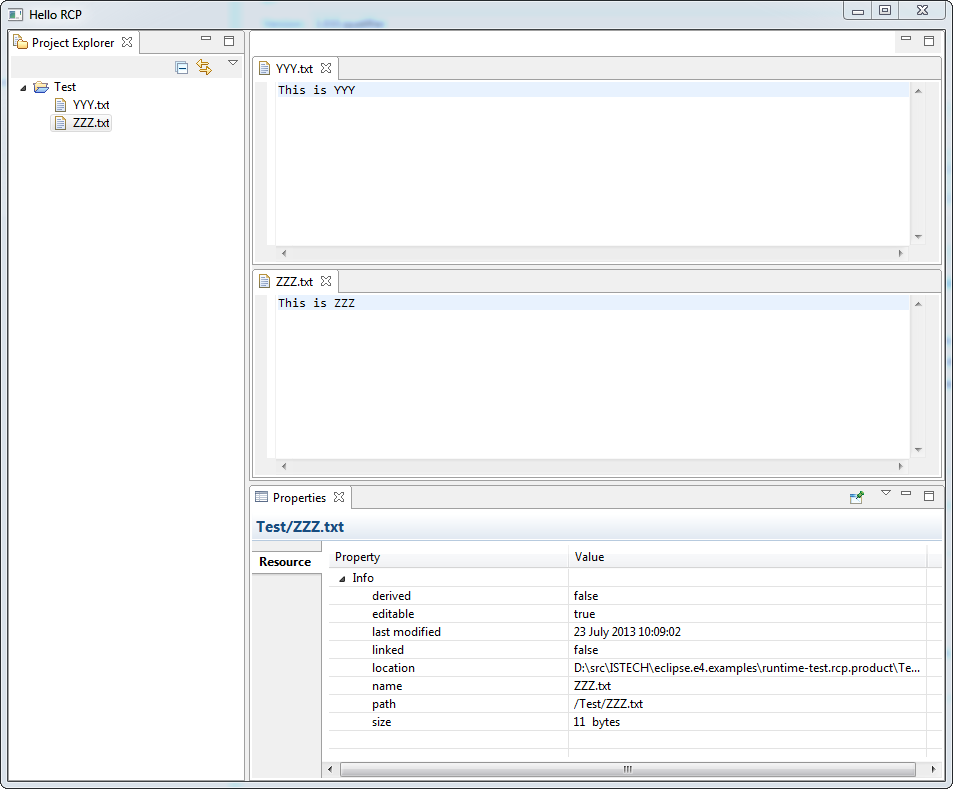

### Eclipse E4 RCP with 3.x views like project explorer, properties, etc

See bog [Dirk's Metric/k](http://dirksmetric.wordpress.com/2012/08/01/tutorial-eclipse-rcp-e4-with-3-x-views-like-project-explorer-properties-etc/)

Built & run with Eclipse43 (Kepler)

####Problems

1. Get the following on startup:

		!ENTRY org.eclipse.core.resources 2 10035 2013-07-23 10:38:00.274
		!MESSAGE The workspace exited with unsaved changes in the previous session; refreshing workspace to recover changes.
	
2. Sometimes need to Right-Click the project explorer to get it to display tree.
